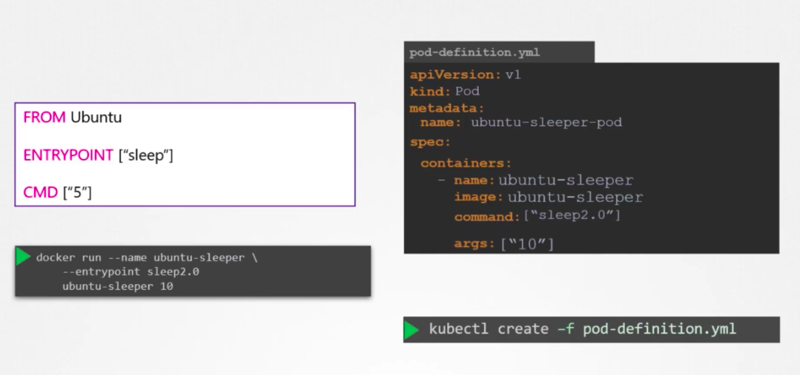
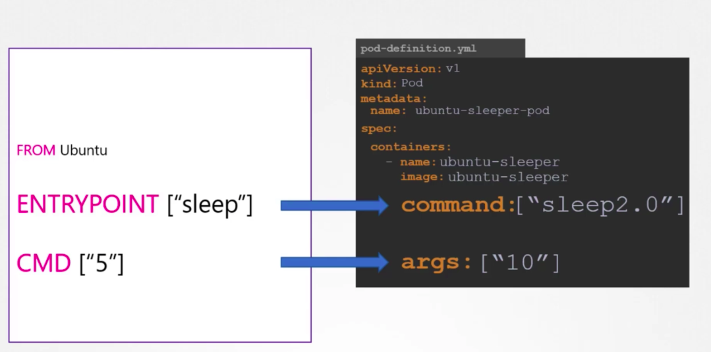

> Background context from docker:  
`CMD`: command run when container brought up, but if there is a command line input, it will override the `CMD` entirely, e.g. if on image `CMD` is `sleep 5` and cli is `docker run ubuntu-sleeper sleep 10`, command running at container startup will be `sleep 10` instead.
>
>`ENTRYPOINT`: command run when container brought up, if there is a command line input, it will append the `ENTRYPOINT` command, e.g. if on image `ENTRYPOINT` is `sleep` and cli is `docker run ubuntu-sleeper 10`, command running at container startup will be `sleep 10`.
>
> Combine those 2 to set a command with default arg, e.g. `ENTRYPOINT` set as `sleep` and `CMD` set as `10`, then if no cli arg is supplied, default command to run will be `sleep 10`.
>
> If want to override `ENTRYPOINT` command tho, can use `--entrypoint <command>` to override it, e.g. `docker run ubuntu-sleeper --entrypoint sleep2.0 20` will run `sleep2.0 20`.

In k8s world, the `ENTRYPOINT` translate to `command` field, which takes in an array, under each container definition; and `CMD` translate to `args` field, which also takes in an array, under each container definition.

