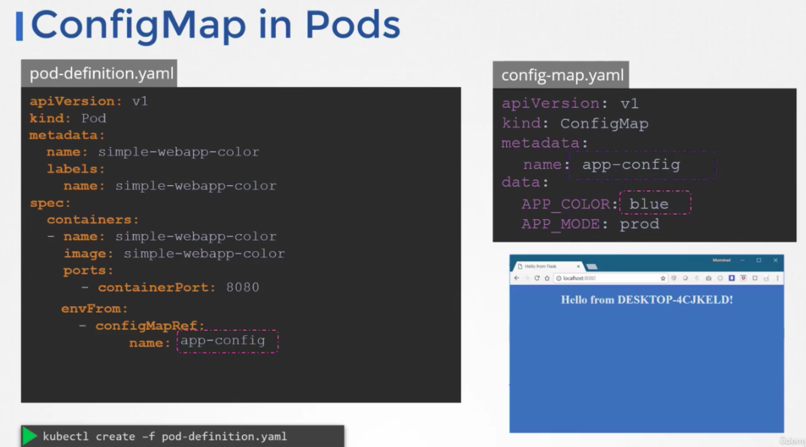

There are a few ways to set env vars.

1. We can set this directly through the `env` field under the container definition, good for plaintext, non-sensitive data:

2. We can use `ConfigMap`: when env var grows, we can extract them into ConfigMap, which is key-value pair store.
- create a `ConfigMap`:

- view `ConfigMap`:

- inject `ConfigMap` to pod:

- multiple ways to inject `ConfigMap`:

3. We can use `Secret` as a practice for sensitive data, but they are actually not safe as a base64 encode:
- create a `Secret`:

We encode the secret when using declarative way.

- encode secrets with base64:

- view `Secret`:

- decode secrets with base64:

- inject `Secret`:

- multiple ways to inject `Secret`:

- each secret entry is mounted to a file if we use `Volume` to inject secret:

Helm secrets or Vault is better choice for actual sensitive data. There are a few notes about the way kubernetes handles secrets. Such as:
- A secret is only sent to a node if a pod on that node requires it.
- Kubelet stores the secret into a tmpfs so that the secret is not written to disk storage.
- Once the Pod that depends on the secret is deleted, kubelet will delete its local copy of the secret data as well.

Read about the [protections](https://kubernetes.io/docs/concepts/configuration/secret/#protections) and [risks](https://kubernetes.io/docs/concepts/configuration/secret/#risks) of using secrets
