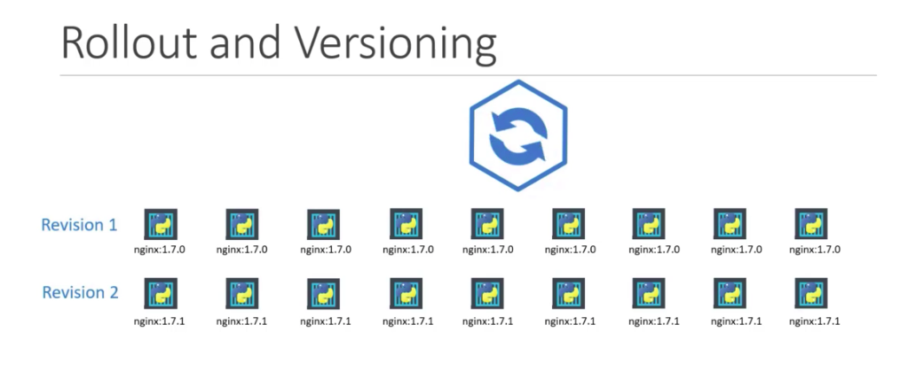
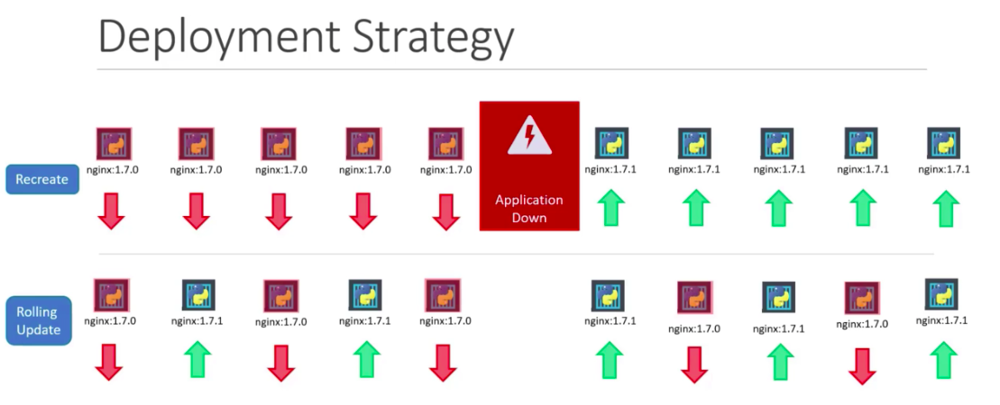
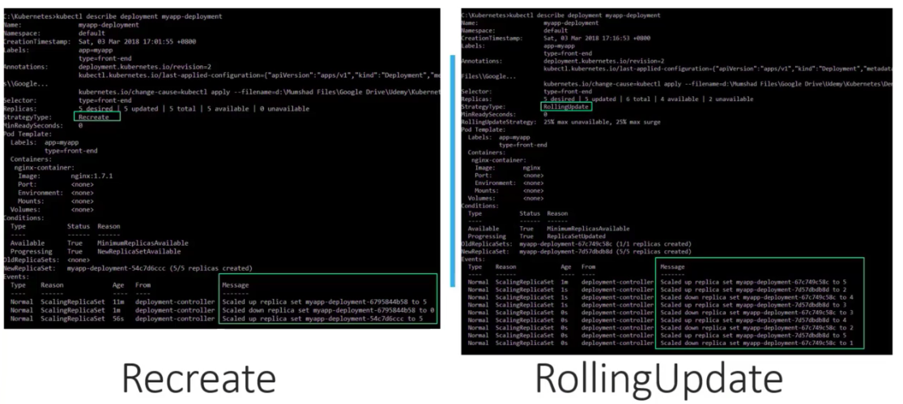
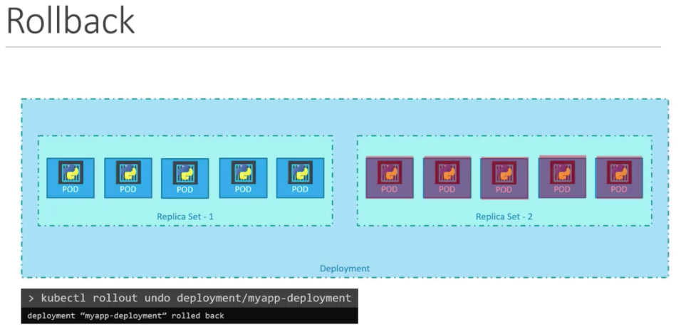
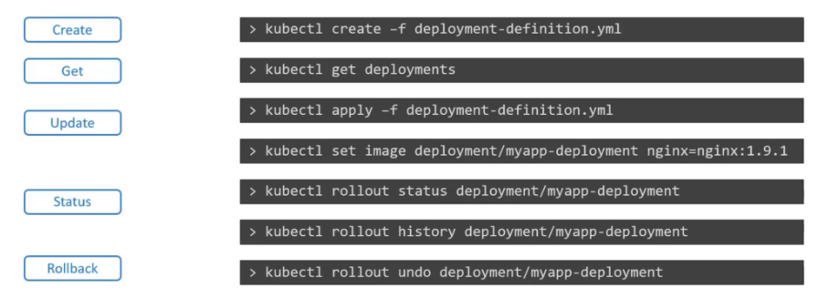

## k8s keeps track of deployment versions


### view rollout status
```bash
k rollout status deployment/<my-deployment>
```

### view rollout history and current version
```bash
k rollout history deployment/<my-deployment>
```

## k8s has 2 deployment strategies



rolling update is the default if no strategy is specified.

Note that if we run `k apply -f <deployment.yaml>`, a new version will be created. But if we edit it on the fly, this change won't be recorded in the <deployment.yaml>.

## k8s allows rollback


```bash
k rollout undo deployment/<my-deployment>
```
k8s will then bring back the old revision and destroy the new version.

## command examples

