- how kube-api works when crud a service in k8s
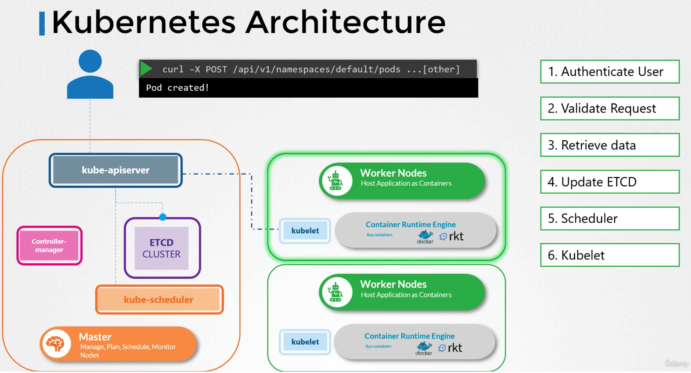

- manually bootstrap kube-api, install k8s the hard way (kubeadm provides this out of box)
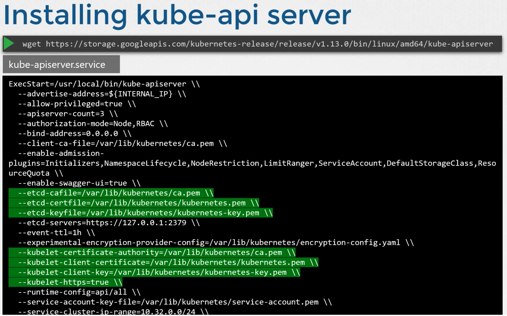

- kube controllers watch and remediate the state
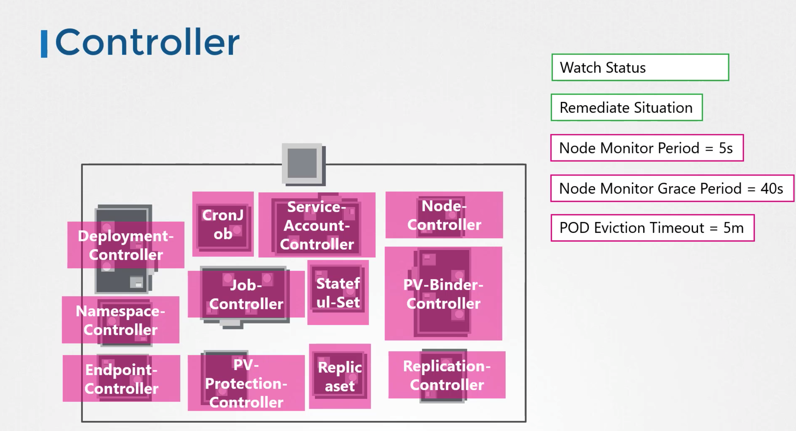

- manually bootstrap kube-controller-manager
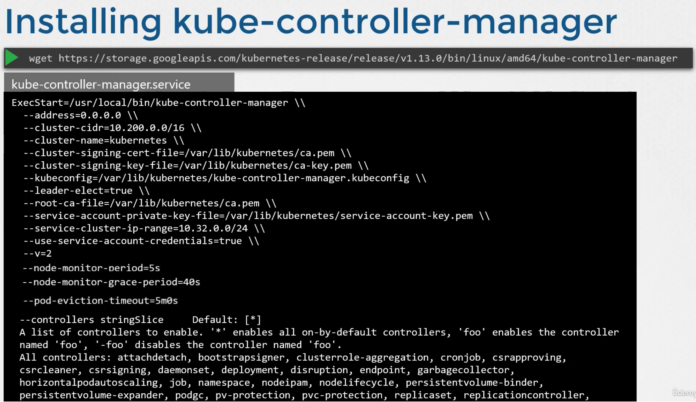

- kube scheduker decide which pod goes where based on various criteria set, and kubelet on each node creates the pod
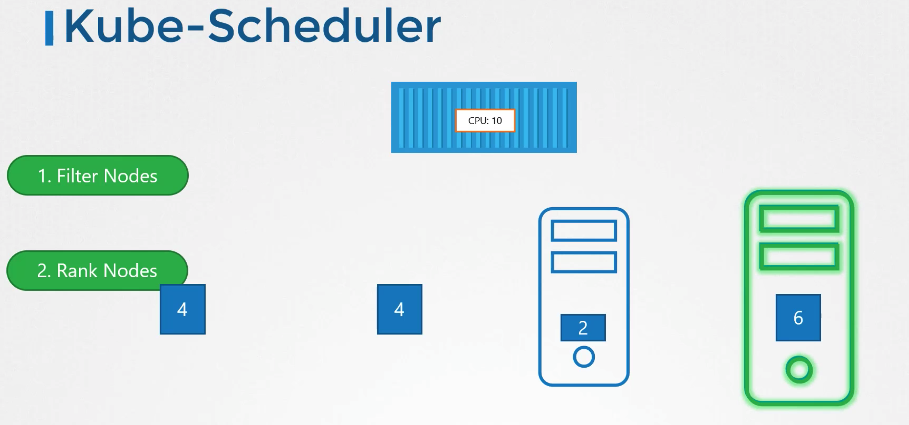

- manually bootstrap kube-scheduler
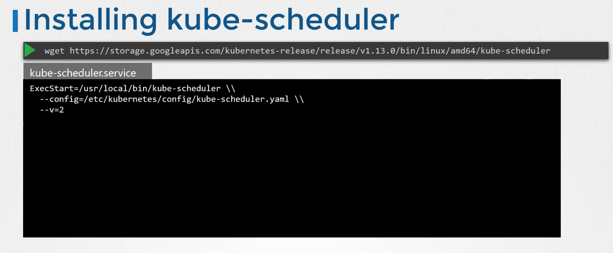

- kubelet: captain on worker nodes, creates pods; single POC for master node, sending heartbeats to master node
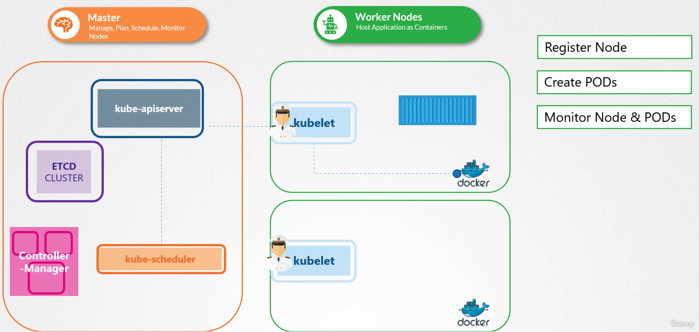

- manually install kubelets on worker nodes *even when using kubeadm*
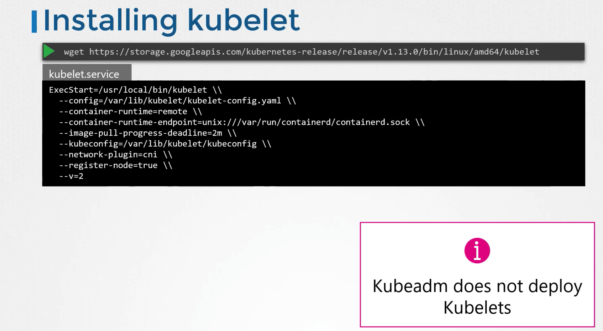

- kube proxy is a process running on each node, it looks for new services and create rules to forward traffic from services to its pod. services is just a virtual component only lives in k8s's memory with no interface, it's accessible by all nodes because of kube proxy
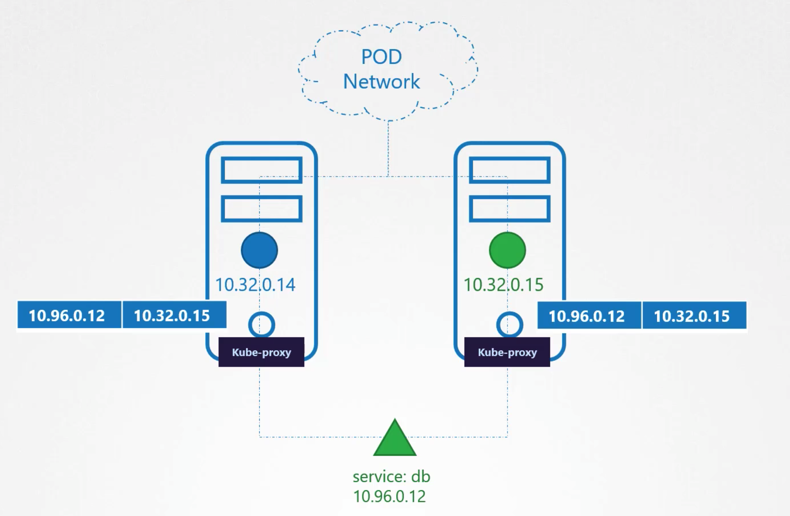

- manually install kube proxy and run it as a service
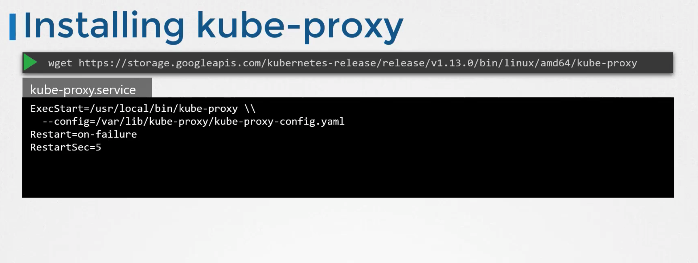

- kubeadm deploys kube proxy as a daemonset
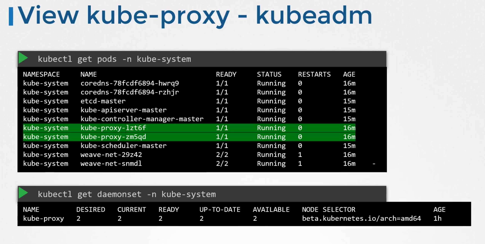
