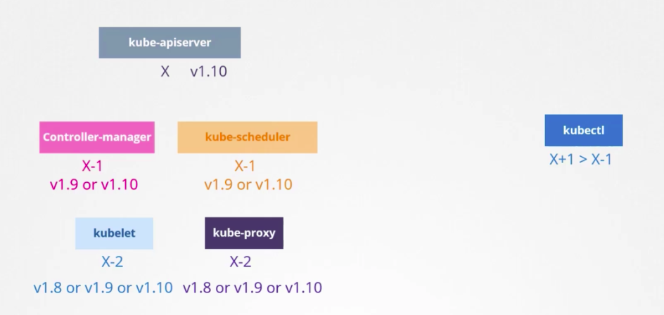
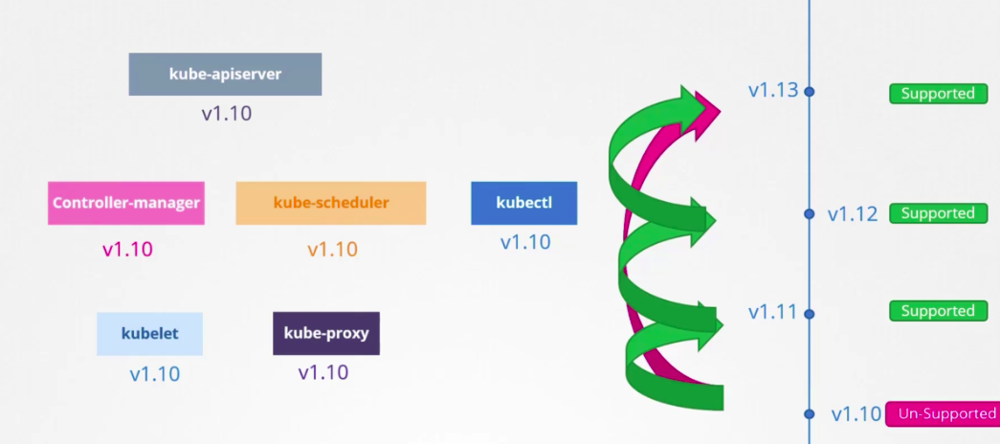
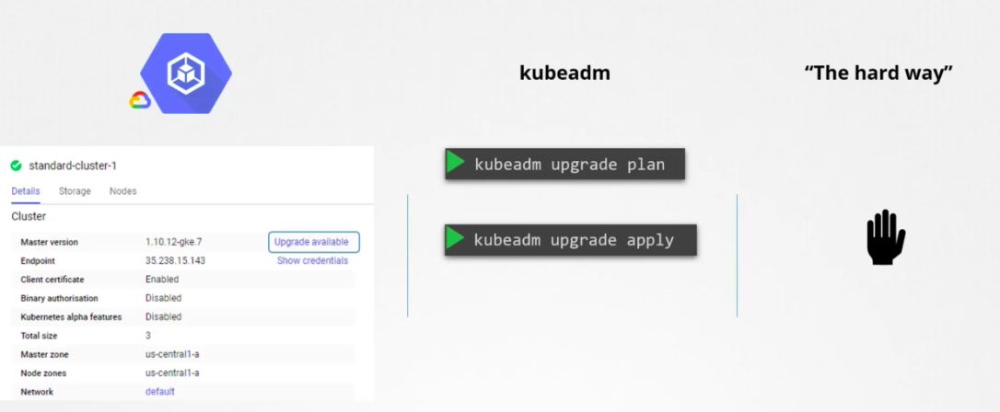
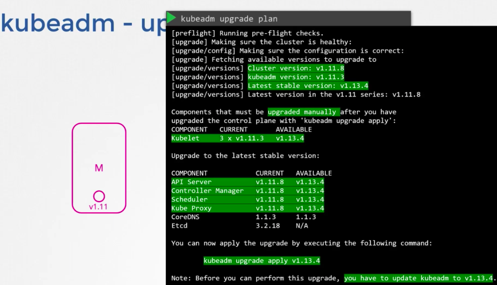
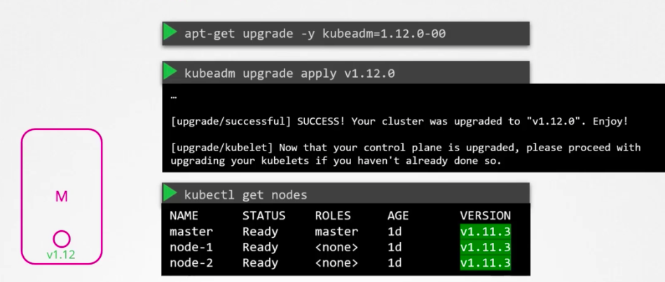
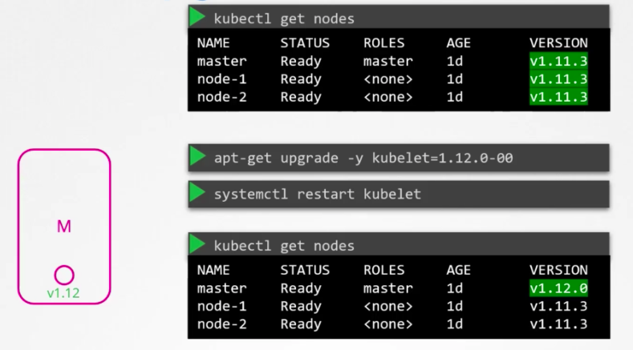

- Do all components need to be on the same version?
No, but `kube-apiserver` is the one that all other components (`controller-manager`, `kube-scheduler`, `kubelet`, `kube-proxy`) talk to, so no components should have higher version than `kube-apiserver`, apart from `kubectl` which can be one version higher than `kube-apiserver`. This allows live upgrade of components - upgrading different components one by one.

- When should you upgrade?
k8s only always supports the latest 3 minor versions. When the version that pushed out your running version is released, you should upgrade. You should upgrade each minor version one by one.

- How to upgrade?
On cloud provider, it's usually as simple as clicking buttons. If you use `kubeadm`, then can use `kubeadm upgrade` commands. If you host the cluster yourself, then you need to manually upgrade like vm patching.

When upgrade, you should upgrade master node (control plane) first, then worker nodes (pod hosting).

When master node is down, all management activities are off. So no kubectl, no pod scheduling, etc. But the running pods on the worker nodes won't be impacted, so your customers won't be affected. Make sure you have enough running pods to handle the load.

When upgrading worker nodes, there are 3 strategies:
- all at once (downtime)
- rolling upgrade, one at a time (time, money)
- rolling upgrade with new nodes (time-, money+)

- How to upgrade with `kubeadm`?
`kubeadm` upgrade. note, you have to manually upgrade `kubelet`

Upgrade process:

When run `k get nodes`, the master node version still showing as old version. This is because when run this command, it doesn't show you the version of the `kube-apisever` of the node, but the version of the `kubelet` registered on the node. (*NOTE* when managing kube cluster yourself instead of using `kubeadm`, you won't have `kubelet` installed on master node, so master node won't even show at `k get nodes` command output).

Now we just need to upgrade `kubelet`.

Worker node upgrade, rolling one by one.

