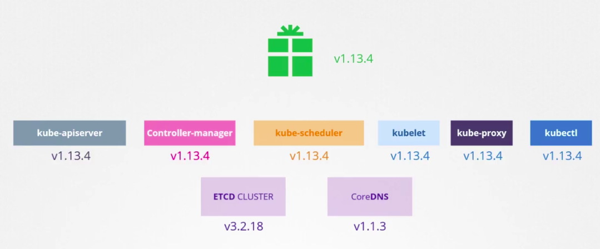

To check the k8s version installed on the cluster, run `k get nodes`, it will show under the `VERSION` column.

Download the version and extract executable from k8s official github release page.

Each release contains the same version of all its control plane components, but the dependency versions could be different. Release note would list the versions of the dependency.

Ref:
https://kubernetes.io/docs/concepts/overview/kubernetes-api/

Here is a link to kubernetes documentation if you want to learn more about this topic (You don't need it for the exam though):

https://github.com/kubernetes/community/blob/master/contributors/devel/sig-architecture/api-conventions.md

https://github.com/kubernetes/community/blob/master/contributors/devel/sig-architecture/api_changes.md
