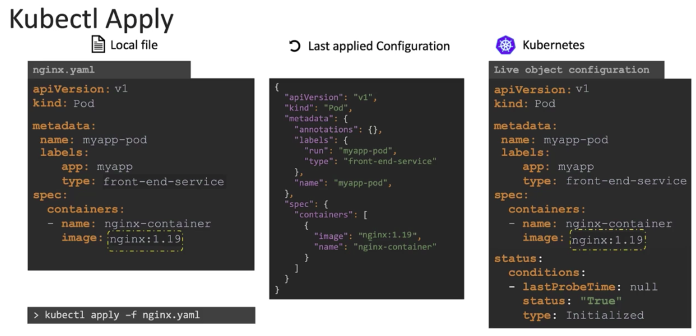

Imperatives gives actions needed to achieve a goal. Declarative gives the final state of the goal and the underlying orchestration server does the steps for you.

### imperative commands are action instructions, quick but not persistent
- `k run`
```bash
k run --image=nginx nginx
```

- `k create`
```bash
k create deploy --image=nginx nginx
```
```bash
# even tho we saved to manifest, we might need to use `--force` flag if the resource already exists, cumbersome
k create -f nginx.yaml
```

- `k expose`
```bash
k expose deploy nginx --port 80
```

- `k edit`
```bash
k edit deploy nginx
```

- `k scale`
```bash
k scale deploy nginx --replicas=5
```

- `k set`
```bash
k set image deploy nginx nginx-container=nginx:1.18
```

- `k replace`
```bash
# even tho we saved to manifest, we might need to use `--force` flag if the resource already exists, cumbersome
k replace -f nginx-deployment.yaml
```

- `k delete`
```bash
k delete -f nginx-deployment.yaml
```

### declarative just set manifest and apply it, k8s figures what to do and won't throw errors if resource already exists
- `k apply`
```bash
k apply -f manifest.yaml
k apply . # apply all manifest in current dir
```

#### how `k apply` works
- it compares local manifest on our system that we just applied to the last applied config
- then apply the differences to the k8s live object stored in k8s memory



- the last applied config is stored as a json under an annotation field `kubectl.kubernetes.io/last-applied-configuration` in k8s live object, __but this's only available when using `k apply` (declarative)__


