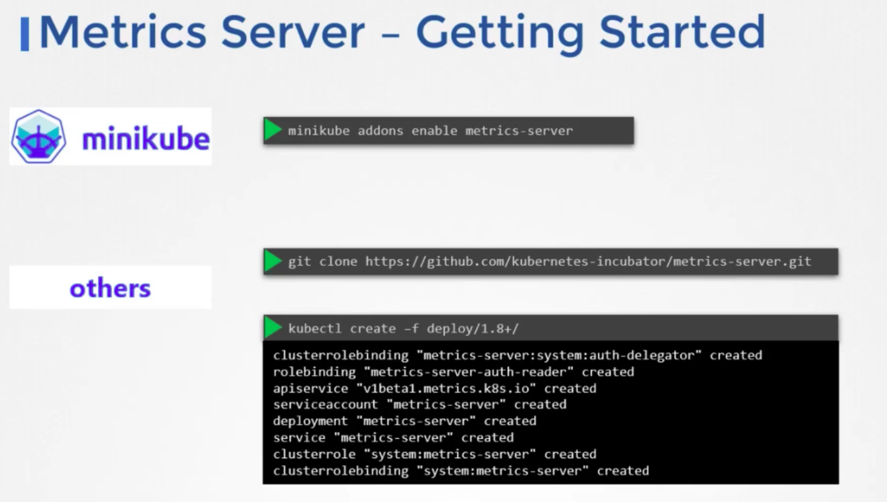
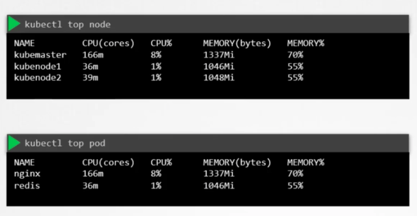

`Heapster` was originally made for the monitoring and analysis purpose of k8s, this was later deprecated and replaced with a slim down version called `Metrics Server`.

You can have one `Metrics Server` per k8s cluster.

`Metrics Server` collects metrics from each pods and nodes using kubelet's `cAdvisor`, aggregates them and stores them _in-memory_. Since it's in-memory, you cannot see historical data. If you want historical data (most likely do), then you need a proper monitoring solution like prometheus/datadog.

### How to install `Metrics Server`?

### How to use `Metrics Server`?

