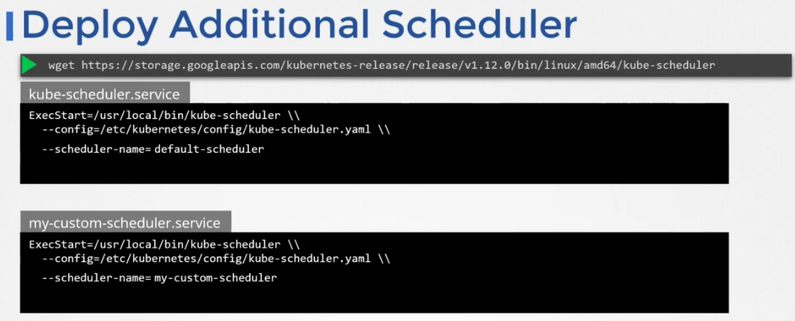
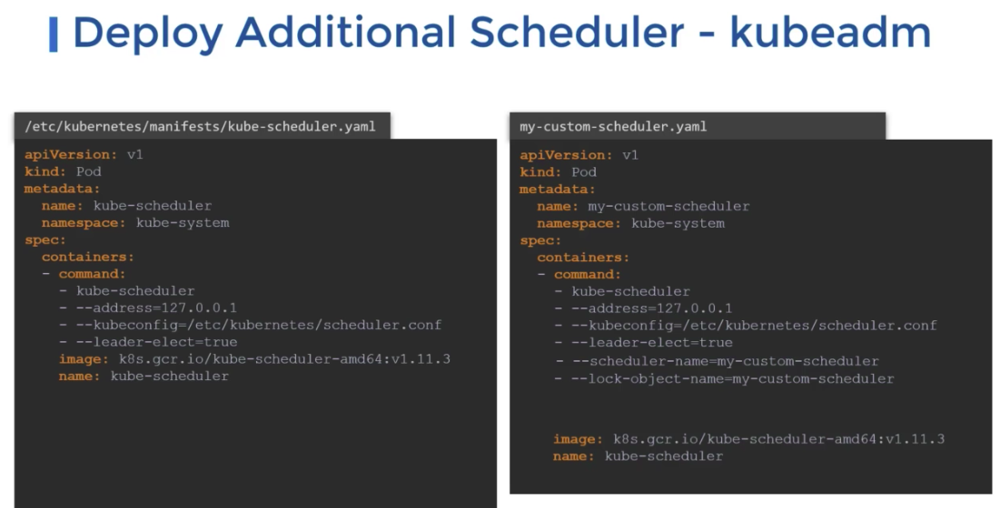
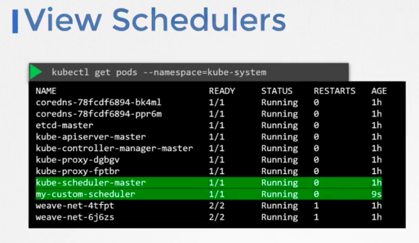
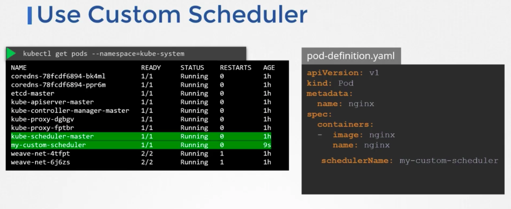
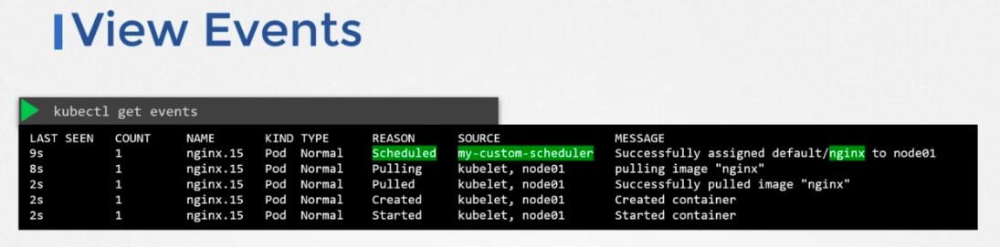
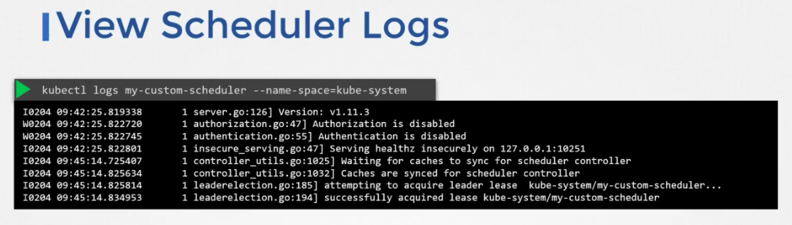

If your service requires a specific scheduling algorithm, you can extend the k8s api and create your own scheduler. You can set your own scheduler as default or additional scheduler. A cluster can have multiple schedulers at the same time.

When creating a pod/deployment, you can instruct k8s to use a specific scheduler.

Deploy additional scheduler:

**Note** Either set `leader-elect` to `false` if you don't have multiple masters, or set `--lock-object-name` to differentiate custom scheduler from default scheduler at leader election process when a master is down.
