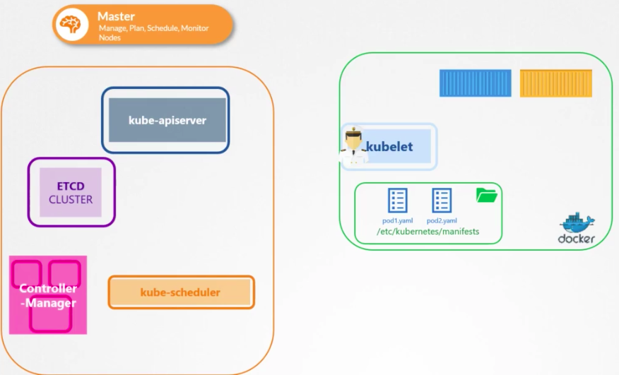
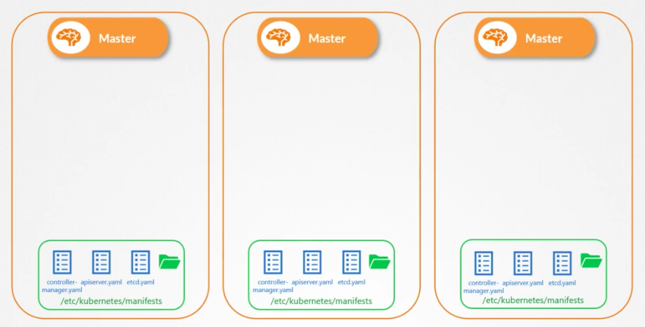
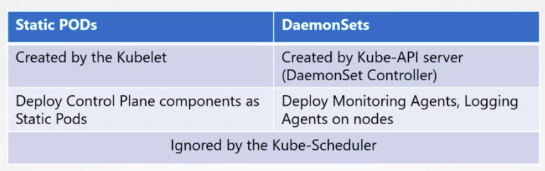

If you just want a singular component to run pods without the master node, you can store your pods manifest under a specified directory on the machine, then configure `kubelet` to read those manifest files.

`kubelet` will then periodically check the directory for files and read them to create pods and make sure the pods stay alive and up-to-date. If you remove a manifest from the directory, the pod is removed automatically.

**NOTE** you can ONLY create PODs this way, no ReplicaSet, Services or Deployment, etc, as they are part of the k8s architecture that replies on master node controllers. `kubelet` only understands pods, which is why it can manage pods without master node.


### How to configure the directory for `kubelet`?

It's set in the `kubelet.service` config file
  1. either under `--pod-manifest-path` directly, e.g.
  ```
  # kubelet.service
  ExecStart=/usr/local/bin/kubelet \\
    --container-runtime=remote \\
    --container-runtime-endpoint=unix:///var/run/containerd/containerd.sock \\
    --pod-manifest-path=/etc/Kubernetes/manifests \\
    --kubeconfig=/var/lib/kubelet/kubeconfig \\
    --network-plugin=cni \\
    --register-node=true \\
    --v=2
  ```
  2. or set in a config yaml file which is passed in through `--config`, e.g.
  ```
  # kubelet.service
  ExecStart=/usr/local/bin/kubelet \\
    --container-runtime=remote \\
    --container-runtime-endpoint=unix:///var/run/containerd/containerd.sock \\
    --config=kubeconfig.yaml \\
    --kubeconfig=/var/lib/kubelet/kubeconfig \\
    --network-plugin=cni \\
    --register-node=true \\
    --v=2
  ```
  ```yaml
  # kubeconfig.yaml
  staticPodPath: /etc/Kubernetes/manifests
  ```

But if you have an existing running cluster, you can inspecting what directory is set in the config, and place your pod manifests there.

### How to quickly find the configured path for the static pod directory?
First run `ps -aux | grep kubelet` to find the kubelet service config, then find the `--config` field or `--pod-manifest-path` field. If `config` field exists, you will need to cat the file and look for `staticPodPath` field. If `--pod-manifest-path` is set, then the value is the path. The kubelet.service config could be visible under `/etc/systemd/system/` too.

### How to see the pods?
Now since we don't have master controller, we can't use `kubectl` command. We will need `docker ps` to see the pods.

### Can `kubelet` run both static pods and pods from master node at the same time?
Yes. `kubelet` can run pods from different sources. It can manage the pod manifests under the configured directory, and it can take instruction from kube-apiserver through http endpoint.


When `kubelet` take pod creation instruction from both `kube-apiserver` and local static directory, `kube-apiserver` is aware of the static pods created through local manifests as well. You will be able to view the static pods when you run `k get pods`. This is because when `kubelet` creates static pods, it also add a read-only mirror object in `kube-apiserver`, this means you can view the static pods like usual, but you can't edit or delete them. Also the static pod's name will be automatically appended with the node name like `static-pod-node01`.

### What's the use case of Static Pods?
You can use static pods to deploy control plane. This way you don't need to download the binary, configure services or worried about the services crashing.  


### What's the difference between DaemonSet and Static Pods?

