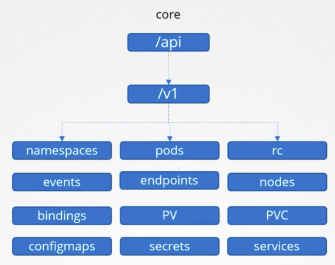
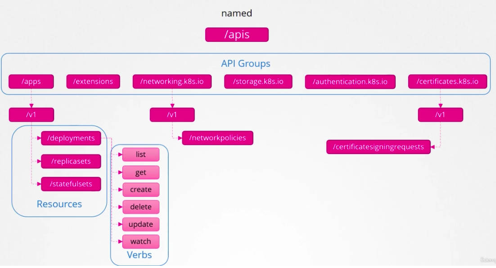
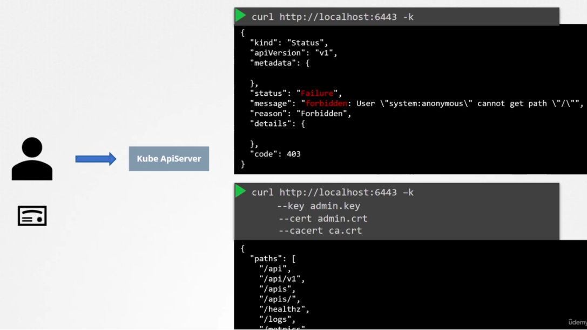
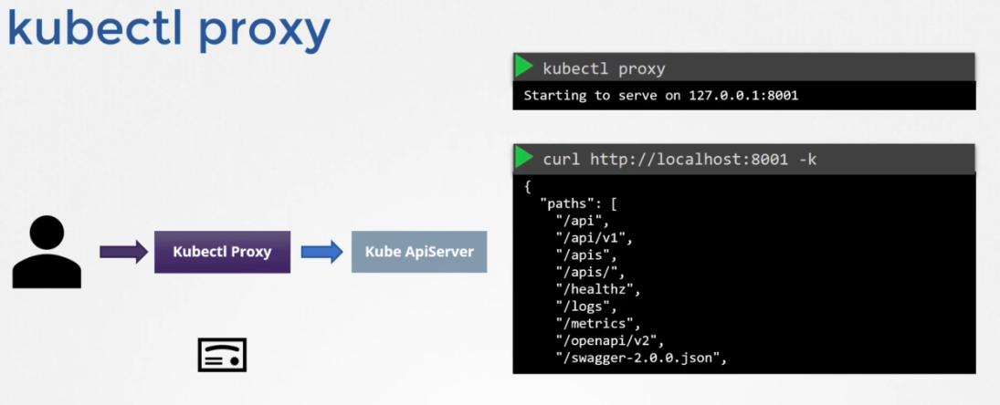

kube's API has following groups:

API: for core resources

APIS: for more detailed resources

When curl API, need to specify tls config, unless use kubectl proxy

When use kubectl proxy, kube proxy will use the kube config to query it for you.

kube proxy != kubectl proxy
kube proxy is used to enable activities between different pods and services across nodes.
kubectl proxy is a http service created by kubtctl to access kube-apiserver.
