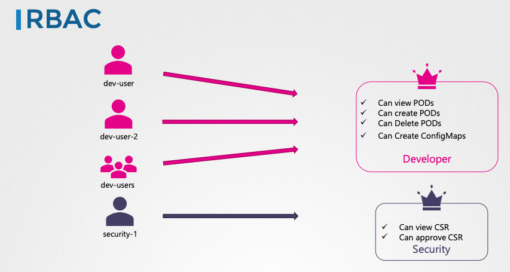

Kubernetes has 6 different authorisation mechanism, i.e. `Node`, `ABAC`, `RBAC`, `Web hook`, `AlwaysAllow` and `AlwaysDeny`.

## Authorisation Mode

Set thru the `--authorization-mode` option on the kube api server. If you don't specify this option, it will be set to `AlwaysAllow` by default.

You may provide a comma-separated list of multiple modes you wish to use.

The request will be checked against each mode in the same order specified in the comma-separated list. Once found an approved mode, the request will be returned.

### Node

For access within the cluster.

Users and kubelet both request kube API to get information. These requests are handled by a node authoriser. Any requests that's from user named `system:node:xxx` and part of the `SYSTEM:NODES` group are granted by the node authoriser.

### ABAC

For external access to the API.

ABAC needs a policy creating for each user/group. When you need to change the access, attribute-based access control requires change in each policy and restart the kube api server to take effect. So it's hard to manage.

### RBAC

For external access to the API.

Define a role and its permissions, then associate users to the role. When changes needed, modify the role, it will apply to all users immediately.

### Web hook

For outsoursing authorisation management.

Requests forwarded to 3rd party to check permission.
