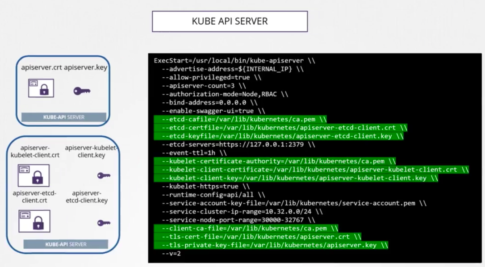
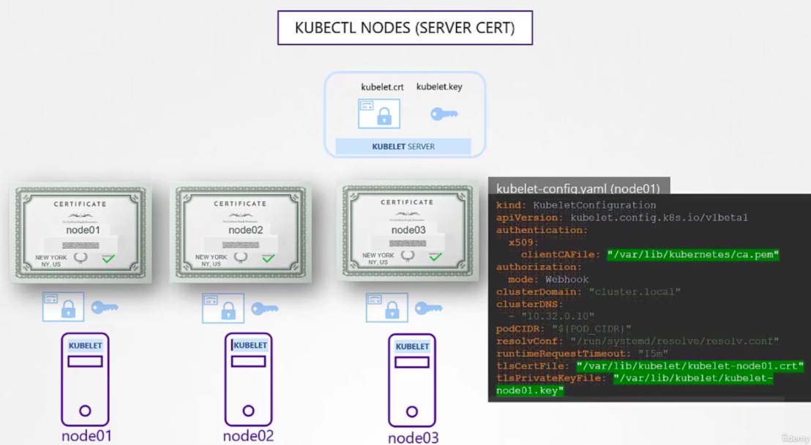
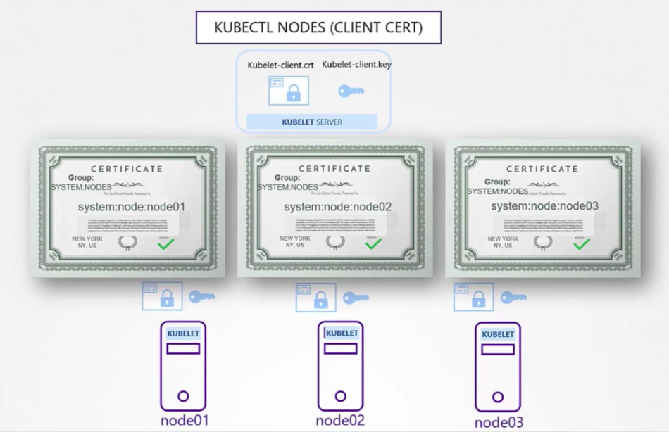

## Create CA
1. Generate CA key
```
openssl genrsa -out ca.key 4096
```

2. Create CA CSR
```
openssl req -new -key ca.key -subj "/CN=KUBERNETES_CA" -out ca.csr
```

3. Create CA public cert
```
openssl x509 -req -in ca.csr -signkey ca.key -out ca.crt
```

## Create Client Cert
1. Generate private key
```
openssl genrsa -out admin.key 4096
```

2. Create CSR
```
openssl req -new -key admin.key -subj "/CN=kube-admin/O=system:masters" -out admin.csr
```

3. Generate public cert
```
openssl x509 -req -in admin.csr --CA ca.crt --CAkey ca.key -out admin.crt
```

## CSR Conf for more detailed config


## kube-apiserver certs
Everything communicate thru `kube-apiserver`, so it requires kubelet certs, etcd certs, client certs


## kubelet certs
Requires server cert for each node for communication.


Requires client cert for each node to communicate with `kube-apisever` too.

