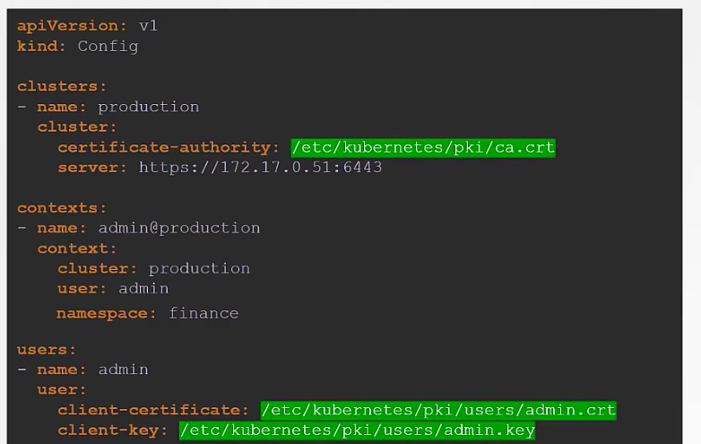

set kube config so that we don't need to pass in ca, key, cert files with every request.

current context shows the current context being used.

use `k config use-context <user@context>` to switch current context.

kube config has ns field for namespace, has cert fields for certs

certs can be specified by path or base64 encoded content.

